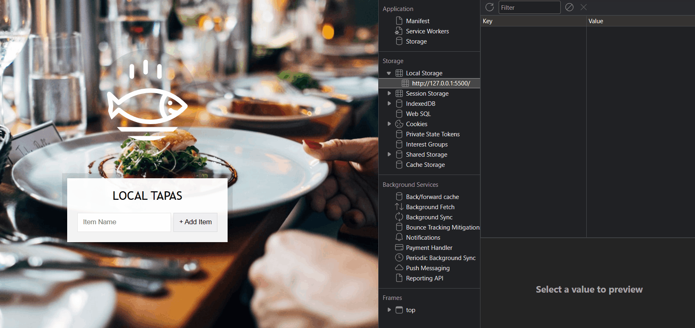

# JavaScript in Web Browsers

## 🎯 Objectives

The goal of this project is to demonstrate my understanding of basic JavaScript concepts such as variables, functions, and objects. I will also learn how to use JavaScript to manipulate the DOM and create interactive web pages.

## ✅ Task: Tapas App

- Open the `task-3-tapas-app` folder in VS Code and open the `index.html` file in your browser.
- I should see a tapas app with list of tapas and a form to add new tapas.
- My task is to make the tapas app work.
- The data should be stored in the `localStorage` property of the `window` object and should persist even after the browser is closed.
- For this task, I will need to edit the just the `script.js` file.

- **_Hint:_** Look up the [querySelector](https://developer.mozilla.org/en-US/docs/Web/API/Document/querySelector) method in JavaScript.
- **_Hint:_** Look up the [querySelectorAll](https://developer.mozilla.org/en-US/docs/Web/API/Document/querySelectorAll) method in JavaScript.
- **_Hint:_** Look up the [addEventListener](https://developer.mozilla.org/en-US/docs/Web/API/EventTarget/addEventListener) method in JavaScript.
- **_Hint:_** Look up the [localStorage](https://developer.mozilla.org/en-US/docs/Web/API/Window/localStorage) property in JavaScript.
- **_Hint:_** Look up the [textContent](https://developer.mozilla.org/en-US/docs/Web/API/Node/textContent) property in JavaScript.
- **_Hint:_** Look up the [classList](https://developer.mozilla.org/en-US/docs/Web/API/Element/classList) property in JavaScript.
- **_Hint:_** Look up the [createElement](https://developer.mozilla.org/en-US/docs/Web/API/Document/createElement) method in JavaScript.
- **_Hint:_** Look up the [preventDefault](https://developer.mozilla.org/en-US/docs/Web/API/Event/preventDefault) method in JavaScript.

## ☕ Resources

If help is needed with any of the concepts covered in this project, here are some resources that might be useful:

- [MDN Web Docs](https://developer.mozilla.org/en-US/docs/Web/JavaScript)
- [W3Schools](https://www.w3schools.com/js/)
- [JavaScript.info](https://javascript.info/)

**_🍀Good luck!_**

- Here is a GIF of the expected result:

